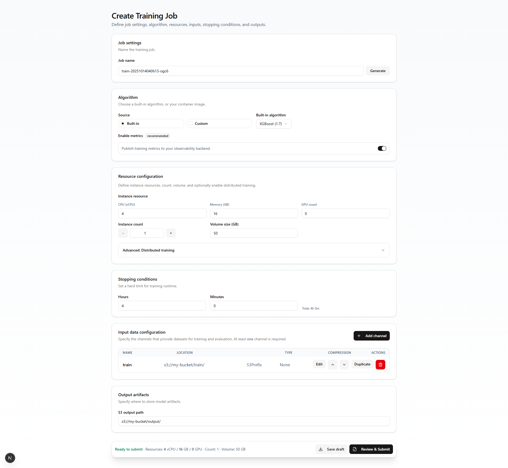

# Training Job UI

A feature-rich React/Next.js interface for configuring machine learning training jobs. The UI lets you define algorithms, allocate compute resources, configure input channels, and review payload JSON before submitting to your backend.

## Getting Started

```bash
npm install
npm run dev
```

Then open <http://localhost:3000> to interact with the form.

## Core Features

- **Algorithm setup** – choose builtin or custom container images and toggle training metrics.
- **Resource configuration** – specify CPU, memory, GPU, instance counts, storage, and distributed settings.
- **Input data configuration** – manage multiple channels, including S3 or local upload sources, with a guided side panel editor.
- **Stopping conditions & output** – set runtime limits and output artifact locations.
- **Payload download** – export the sanitized job payload JSON for API calls.

## Tech Stack

- Next.js 15 (App Router)
- TypeScript + React
- Tailwind CSS + shadcn/ui components
- lucide-react icons

## Folder Structure

```
src/
  app/
    page.tsx       # Main form UI
    layout.tsx     # App layout
    globals.css    # Global styles
  components/ui/   # shadcn/ui primitives
components.json    # shadcn component registry
```

## Scripts

- `npm run dev` – start the development server
- `npm run build` – create an optimized production build
- `npm run start` – serve the built app
- `npm run lint` – lint the codebase with ESLint

## Preview



> Tip: capture a screenshot of the form and save it as `public/preview.png` to replace the placeholder above.

## Contributing

1. Fork the repo and create a feature branch.
2. Make your changes and add tests or documentation as needed.
3. Submit a pull request with a clear summary of your work.